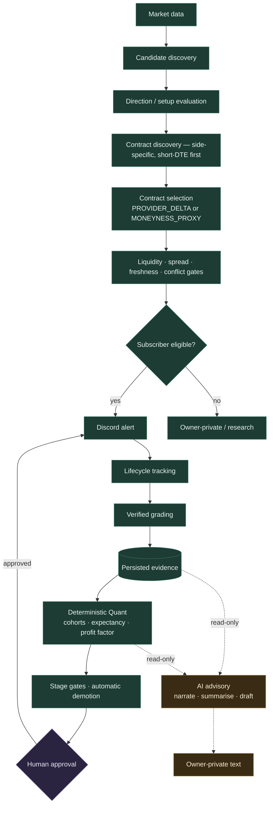

# OptiScan — AI Architecture and Roadmap

**Written:** 2026-08-03 · **Against:** `e7882ed` · **Verified on:** production
`optiscan-production.up.railway.app`, read live.

This document explains, in plain language, what AI actually does inside OptiScan
today — not what is planned, and not what the word "agent" in a filename might
suggest. Every claim below was checked against the repository or read from
production. Where something is unverified, it says so.

---

## 1. The one-paragraph answer

**AI does not trade, and it cannot.** Every decision that reaches a subscriber —
which symbols to scan, whether a setup exists, whether it is bullish or bearish,
which contract to buy, whether the spread is acceptable, whether to send — is
made by deterministic TypeScript with no model call anywhere in the path. AI runs
*after* those decisions are already persisted, and it writes English, not orders.
Its jobs are scheduled overnight and weekly. If the Anthropic API were removed
entirely, the scanner would not notice.

---

## 2. Three things that are constantly confused

OptiScan contains three different kinds of "intelligence", and calling all of
them AI is how a system starts believing its own marketing.

| | What it is | Where it lives | Authority |
|---|---|---|---|
| **Deterministic logic** | if/else, thresholds, ranking, gates | `lib/research/options/*`, `lib/scan-core.ts` | **Total.** Decides every trade-facing thing |
| **Quant / statistics** | returns, cohorts, expectancy, profit factor, confidence intervals | `lib/ai/quant-*.ts`, `lib/research/*` | **Decides stage gates and demotion.** No model involved despite living under `lib/ai/` |
| **LLM (Anthropic)** | narration, summarisation, drafting, Q&A | `lib/ai/provider.ts` + jobs | **None.** Advisory only |

**`lib/ai/quant-research.ts` and `lib/ai/quant-dashboard.ts` contain no model
call.** They are statistics that happen to sit in the `ai/` folder. That
directory name is the single most misleading thing in the repository, and it is
why "how does the AI work" is a hard question to answer from a file listing.

There is **no machine-learning model** in OptiScan. No training, no inference, no
weights. `lib/ai/shadow-model.ts` is a deterministic shadow scorer, not an ML
model — the filename oversells it.

---

## 3. Current AI feature inventory — verified

Read live from `/api/ai` on 2026-08-03:

```
enabled: true · hasApiKey: true
nightlyDiagnosisEnabled: true · weeklyProposalsEnabled: true · recapEnabled: true
nightlyModel: claude-haiku-4-5 · weeklyModel: claude-sonnet-5
totalRuns: 31 · spendUsd 0 this month · softLimit $5 · hardLimit $20
```

| Feature | Model | Trigger | Output | State |
|---|---|---|---|---|
| **Nightly diagnosis** | `claude-haiku-4-5` | after 20:15 ET, trading weekdays | narrative over the day's persisted outcomes | **LIVE_AND_CONNECTED** |
| **Weekly proposals** | `claude-sonnet-5` | Fri ≥21:00 ET / Sat | bounded research proposals | **LIVE_AND_CONNECTED** |
| **Private recap** | configurable | scheduled | short owner recap → `DISCORD_WEBHOOK_RECAP` | **LIVE BUT UNDELIVERABLE** — the recap webhook is unset (§6) |
| **Advisory chat (Owner Copilot)** | provider default | owner request | grounded Q&A over a canonical findings report | **LIVE_AND_CONNECTED** |
| **Asymmetry explain** | provider default | research | explains High-Asymmetry captures | **LIVE_BUT_PARTIAL** — research-only lane |
| **Content / Twitter drafts** | **none — templates** | scheduler | Twitter/X draft text | **RULE_BASED_NOT_AI** |
| **Shadow model** | **none — deterministic** | scan | shadow score | **RULE_BASED_NOT_AI** |
| **Quant research / dashboard** | **none — statistics** | scheduled | cohorts, expectancy | **RULE_BASED_NOT_AI** |

**Model routing already exists.** The roadmap item "propose task-appropriate
routing" is largely done: cheap narration on Haiku 4.5, stronger reasoning on
Sonnet 5, hard monthly cost ceilings, and per-job timeouts. This was a pleasant
surprise and should not be re-planned.

### The Twitter content engine is deliberately NOT AI

`lib/content/content-event-engine.ts` is templates plus business rules, and its
header says "NO language model, EVER." A template line whose placeholder is
missing is **dropped** rather than filled, so the engine cannot emit a fabricated
number or a literal `{{strike}}`. For content that makes performance claims about
real trades, a deterministic template that can only render facts it actually has
is the correct design, and it should stay that way.

---

## 4. The grounding guard works — and it fired

The most important evidence in this audit is a **failure** recorded in
production:

```
lastFailureType: nightly_diagnosis
lastFailureError: "validation failed: narrative contains an
                   unsupported quantitative claim: 8%"
```

The model produced a number it could not support from the evidence packet, and
the validator **refused the entire output** rather than publishing it. That is
the single most valuable property in the whole AI layer, and it is observed
rather than asserted.

The safety contract in `lib/ai/advisory-chat.ts` is enforced structurally, not by
prompt text: the execution path imports nothing from the scanner, delivery,
Discord, grading, or paper-mutation layers. There is no code path from an answer
to a trade, and no APPLY mode — "build fix prompt" produces text for a human to
copy.

---

## 5. Decision flow — one opportunity, end to end



**Read the dotted lines.** Every arrow into the AI box is read-only, and the only
arrow out of it points at owner-private text. There is no edge from AI back into
the deterministic path. That is the property that has to survive every future
change to this system.

**If AI is unavailable:** discovery, direction, contract selection, gating,
delivery, lifecycle, grading, Quant, stage gates and automatic demotion all run
unchanged. Nightly and weekly narration is skipped and the run is recorded as
failed. Nothing waits on a model.

---

## 6. What this audit found broken

### 6.1 The Twitter prompts stopped for a configuration reason — and then a code reason

The pipeline is **healthy**. On 2026-08-03 it generated **50 drafts**:
CONVICTION_INCREASED 38, CLOSED_WINNER 6, JUST_ENTERED_RADAR 4,
WHY_THIS_WORKED 2. Every one of them:

```
discord_delivery_status: "SKIPPED_NO_WEBHOOK"
```

`/api/discord/health` gives the cause without ambiguity:

```
webhooks: { options: true, watchlist: true, recap: false }
```

Content drafts route to `DISCORD_WEBHOOK_RECAP`, which is **unset in
production**. That is configuration, and it is the owner's to set.

The **code** defect underneath it was worse. `runContentDraftsScan` marks the
source event `PROCESSED` *before* checking the webhook, so a skipped event never
re-enters the PENDING scan; and the retry query excluded `SKIPPED_NO_WEBHOOK`.
Together those made deferral permanent — setting the webhook tomorrow would have
delivered future content and **stranded all 50 existing drafts forever**,
including closed-winner report cards whose lifecycle events are spent and cannot
be regenerated. Fixed in `e7882ed` with a bounded recovery pass that delivers the
persisted text verbatim (no regeneration, no re-dating).

**Owner action required:** set `DISCORD_WEBHOOK_RECAP`. The stranded drafts will
then be recovered rather than lost. This also un-blocks the AI private recap,
which routes to the same webhook.

### 6.2 AI observability is thinner than the rest of the system

`ai_job_runs` records job type, model, status, error category, tokens, latency,
retries and estimated cost — genuinely good. What it does **not** record is
**which evidence IDs went into a given answer**. So "why did the AI say that?"
can be answered at the level of *which job ran*, but not *which opportunity,
cohort or contract it was looking at*.

That is the highest-value AI gap, and it is a prerequisite for trusting any
future AI output more than we do today. It is Phase 1 below, not Phase 3.

---

## 7. Authority matrix

| Capability | Deterministic | Quant | AI | Human |
|---|:---:|:---:|:---:|:---:|
| Candidate discovery | ✅ | | | |
| Direction classification | ✅ | | | |
| Contract discovery & selection | ✅ | | | |
| Liquidity / spread / freshness gates | ✅ | | | |
| Entry & exit | ✅ | | | |
| Paper open/close | ✅ | | | |
| Grading | ✅ | | | |
| Cohorts, expectancy, profit factor | | ✅ | | |
| Stage gates | | ✅ | | |
| **Automatic demotion** | | ✅ | | |
| **Promotion to subscribers** | | | | ✅ |
| Explanation, summary, drafting | | | ✅ | |
| Research hypotheses | | | ✅ draft | ✅ approve |
| Twitter/X drafts | ✅ templates | | | ✅ post manually |

**AI holds no ✅ in any row that can move money.** Note that demotion is
automatic while promotion requires a human — deliberately asymmetric, because a
system that can protect subscribers without permission but cannot expose them
without it fails in the safe direction.

---

## 8. Roadmap

Ordered by *evidence value*, not by sophistication. The temptation with AI is to
skip to the interesting part; the reason not to is that every item in Phase 3
produces claims nobody can check until Phase 1 exists.

### Phase 1 — Trust and visibility *(do this first)*

1. **Record evidence IDs on every AI run.** Opportunity IDs, cohort IDs, exact
   OCCs, date ranges. Without this, no AI claim is auditable after the fact.
2. **Rename what is not AI.** `lib/ai/quant-*.ts` and `shadow-model.ts` are
   deterministic. The names are load-bearing when the next person asks what the
   AI decides.
3. **Surface AI status in the owner dashboard.** `/api/ai` already returns
   everything needed, including the cost ceiling and the last validation refusal.

### Phase 2 — Owner intelligence

4. **Set `DISCORD_WEBHOOK_RECAP`** and confirm both content drafts and the AI
   recap land. This is one environment variable and it unblocks two features.
5. **Opportunity explanations** — why *this* setup, why *this* contract, what
   would invalidate it, grounded in the contract-funnel evidence now persisted in
   `contract_funnel_evidence`.
6. **Loss and missed-opportunity explanations** over the deterministic root cause,
   never inventing one.
7. **Weekly owner brief** — mostly assembled from existing jobs.

### Phase 3 — Research assistance

8. Hypothesis drafting from Quant findings *(bounded, never a production rule)*.
9. Experiment summarisation *(deterministic code still owns stage transitions)*.
10. Historical-analog explanation *(retrieval must be deterministic; AI explains
    what was retrieved and may not invent an analog)*.
11. Regime narrative over deterministic regime metrics.

### Phase 4 — Advanced research *(nothing here is close)*

12. Calibrated ML ranking of candidates.
13. **Missing-Greek estimation** — the most attractive ML idea in this system,
    because §9 below shows a third of a 0DTE chain routinely arrives without
    greeks. It must ship as `MODEL_ESTIMATED_DELTA`, never as `delta`, and must
    be validated against contracts where the provider *did* publish one.
14. Anomaly detection, contract-quality modelling.

**No item in Phase 4 may reach subscribers without:** time-split train/validation/
test, calibration, drift monitoring, deterministic safety overlays, live shadow
mode, automatic paper validation, forward validation, and human approval. A model
prediction may **rank** candidates; it may never override a hard safety gate.

---

## 9. Retrieval — what the Copilot should read

**An Owner Copilot already exists** (`lib/ai/advisory-chat.ts`) and should be
extended rather than rebuilt. It reads a canonical findings report and explicitly
never queries arbitrary raw tables — a deliberate constraint worth keeping.

Recommended: **structured SQL retrieval for every numeric fact** (returns,
contracts, timestamps, stage) and embeddings **only** for genuinely semantic
lookups (similar thesis narratives, incident text, research notes).

**A vector match must never be the authoritative source of a return, a contract,
a timestamp, or a strategy stage.** Semantic similarity is a good way to find a
document and a terrible way to establish a number.

---

## 10. Rejected — deliberately not building these

| Proposal | Why not |
|---|---|
| **LLM contract selection** | Non-deterministic, unauditable, unreplayable, and directly in the money path. The deterministic selector is testable against a fixture; a model is not |
| **AI-authored root causes** | Deterministic classification must assign the cause; AI may explain the one already assigned. Otherwise the loss-learning loop learns from the model's guesses |
| **Autonomous Twitter posting** | Irreversible and outward-facing. Drafts stay drafts |
| **An LLM per responsibility** | 28 responsibilities do not need 28 agents. Most are modules inside existing services |
| **AI in the scanner loop** | Latency and cost in a 2-second tick, for zero decision value |
| **AI-set thresholds** | A threshold changed by a model is a strategy change nobody approved |

---

## 11. What must be proven before AI affects subscribers

Nothing in this document proposes that AI should affect subscribers. If it ever
does, the bar is:

1. Evidence IDs on every output, auditable after the fact.
2. A deterministic evaluation suite that AI passes before deployment.
3. Adversarial cases pinned: missing delta, stale quote, conflicting CALL/PUT
   evidence, last-trade-only extreme gain, tiny sample, strategy-version drift, a
   losing alert with high MFE, an apparent winner with an unexecutable spread,
   and a Twitter prompt for an alert that was never sent.
4. Forward validation on frozen rules.
5. Human approval.

Until then AI explains, and deterministic code decides.
