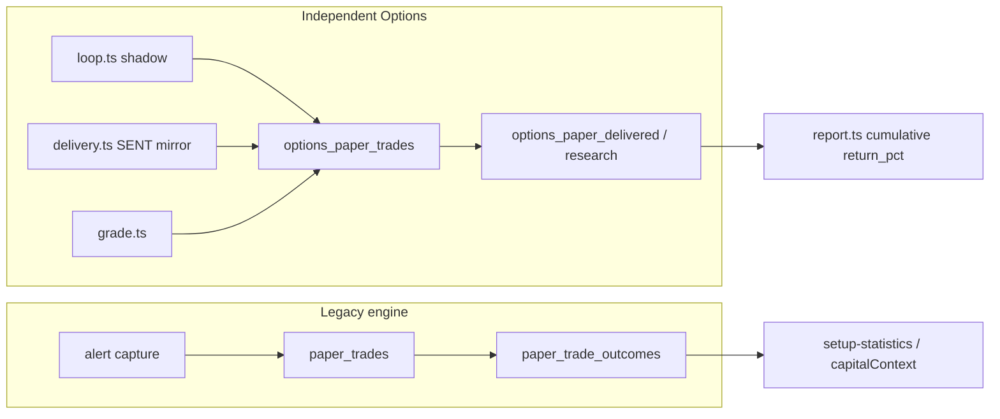

# Options Paper Trading Integrity Audit

**Date:** 2026-07-24  
**Scope:** Read-only audit of whether paper trading simulates real option contracts and dollar P&L (not underlying substitutes). No live logic changed.  
**Codebase commit audited:** `9bf4b84` (`origin/main`)  
**Proof tests:** `tests/options-paper-integrity.test.mjs`

---

## Executive verdict

| Question | Answer |
|---|---|
| Do true option positions exist? | **Yes** — `options_paper_trades` stores OCC symbols, strikes, expirations, bid/ask/mid, entry/exit fills, IV, delta. Grader closes on option quotes via `realOptionExit()`. |
| Is the displayed subscriber paper equity curve trustworthy as dollar equity? | **No** — `readOptionsReportOnDb()` builds a **cumulative return-points** curve from `return_pct`, not starting balance × contracts. No fees, no explicit qty column (implicit 1×100). |
| Authoritative subscriber table | `options_paper_trades` where `paper_kind='DELIVERED_ALERT_PAPER'` (view: `options_paper_delivered`) |
| Authoritative legacy table | `paper_trades` + `paper_trade_outcomes` (separate engine; can mix stock + options) |

**Stop:** Repair phases below require explicit approval before implementation.

---

## Part A — Production verification (2026-07-24)

| Check | Result |
|---|---|
| Local dev server on `:8780` stopped | **Yes** — pid 2640 terminated; port down |
| Production URL | `https://optiscan-production.up.railway.app` |
| `GET /api/healthz` | **200** — `schemaOk=true`, `schemaMissing=[]`, `dbDirectory=/app/data` |
| Deployed `commitShort` | **`664e162`** (docs on `270b059`) — **not** `9bf4b84` after 6×20s polls |
| `GET /api/runtime/schema` | **401** — production has `SCAN_API_TOKEN` set; token not in local `.env.local` |
| `GET /api/ai` | **401** (auth required) |
| `GET /api/ai/funnel-explorer` | **404** on production (route absent until `9bf4b84` deploys) |
| Funnel Explorer UI on production `/ai` | **Not verifiable** — observability sprint not deployed |
| Railway logs | CLI not authenticated; GitHub latest deployment status for `5592222773` = **failure** (Railway dashboard link only) |

**Blockers for full Part A checklist:** `SCAN_API_TOKEN` and `PUBLIC_APP_URL` are unset in local `.env.local`. Production auth is correctly enforced (401 without token).

**Local code verification (commit `9bf4b84`, same tree as `origin/main`):** Funnel Explorer route and UI exist in repo; production redeploy from `9bf4b84` is pending.

---

## Dual-system map



| Lane | Writers | P&L basis | Reporting |
|---|---|---|---|
| Independent research / subscriber mirror | `paper.ts`, `delivery.ts`, `grade.ts` | Option premium ×100, implicit 1 contract | `report.ts` — DELIVERED vs RESEARCH separated |
| Legacy primary paper | `paper-engine.ts`, `paper-trading.ts`, `trade-outcome.ts` | Option ×100 or stock ×1; fees in outcomes | `/api/paper/trades` dollar equity from starting balance |

---

## Field completeness matrix

| Field | `options_paper_trades` | `paper_trades` / `paper_trade_outcomes` |
|---|---|---|
| OCC symbol | ✅ stored | ✅ |
| Side / strike / expiration / DTE | ✅ | ✅ |
| Bid / ask / mid / spread | ✅ at entry; marks on exit ticks | ✅ |
| Entry / exit fill | ✅ conservative model (research) or frozen mid (delivered) | ✅ slippage model |
| IV / delta | ✅ entry only | ✅ entry greeks |
| Gamma / theta / vega | ❌ | ✅ on legacy entry |
| Contracts / qty | ❌ implicit 1 | ✅ |
| Fees | ❌ not in research lane | ✅ |
| Account equity before/after | ❌ | ✅ legacy engine |
| Underlying in P&L | ❌ context only | ❌ (intrinsic at expiry only) |

---

## Ten integrity questions

### 1. Return from option premium vs underlying?

**Yes — live grading uses option premium.** `realOptionExit()` in `lib/research/options/paper.ts` computes `returnPct = (exitFill - entryFill) / entryFill × 100` and `pnl = (exitFill - entryFill) × 100`.

Underlying forward returns appear only in `lib/research/options/replay.ts` (`gradingBasis: "UNDERLYING_FORWARD"`) for historical lab — **not** subscriber paper P&L.

### 2. Any grading via underlying forward as substitute for option P&L?

**Not in live paper grading.** Strategy catalog documents `underlying_forward_return` for replay research. `paper-class.ts` rejects `pnlBasis === "underlying"`.

### 3. Strategy mix on one equity curve?

**Subscriber options report:** No — `readOptionsReportOnDb()` uses `options_paper_delivered` only; strategies bucketed separately.  
**Legacy `/api/paper/trades`:** Yes — stock and options share `paper_trades` and one dollar equity sum.

### 4. True position row vs callout label?

**Yes for independent lane** — full row in `options_paper_trades` with fills and exit state. Delivered mirror idempotent on `alert_id` + `paper_kind='DELIVERED_ALERT_PAPER'`.

### 5. Dollar equity = qty × 100 × premium vs averaged %?

Research lane stores **per-trade `pnl` (1 contract)** and **`return_pct`**. Report aggregates **mean `return_pct`** and cumulative return-points — **not** dollar equity from a starting balance.

### 6. Mark-to-market: bid/ask/mid/last?

Grader uses **fresh bid+ask** → `realOptionExit()` (60% toward bid). Marks table stores bid, ask, computed exit_fill. Legacy marks use **quote mid** (`paper-trading.ts`).

### 7. Slippage / spread fill realism?

Research: **60% mid→ask entry**, **60% mid→bid exit** (`conservativeEntryFill`, `realOptionExit`). Delivered mirror entry uses **frozen displayed mid** (`delivery.ts` L79–81) — less conservative than shadow entries.

### 8. Worthless expiration → −100%?

**Not always.** Fresh penny quote → large loss but not exactly −100% (see F2 in proof tests). Expiration with **no usable quote** → `expiration_no_quote`, **`pnl=null`, `return_pct=null`** (honest, not fabricated −100%).

### 9. Targets/stops on option premium vs underlying?

**Persisted targets** from `computeOptionTargets()` are **option premium** T1/T2/stop. **Grader exits** on fixed **option return %** thresholds (`OPTIONS_PAPER_TAKE_PROFIT_PCT` default +60%, stop −40%) — **not** on persisted T1/stop premium levels. **Finding:** target/stop disconnect (classification: **reporting-only defect** + **incorrect fill model** for delivered entry).

### 10. Multi-contract / partial exits in realized P&L?

**Research lane:** `realOptionExit(..., contracts)` supports qty in formula but DB has **no contracts column** — always 1. **No partial exits.** Legacy lane supports `contracts` and full close.

---

## Five trade traces (formula reconstruction)

Production row-level export blocked (auth). Traces below use **`realOptionExit()`** — same function persisted by `gradeOpenOptionPositionsOnDb()`. Recomputation uses:

```
entryDebit = entry_fill × 100 × qty
exitValue  = exit_fill × 100 × qty
realizedPnL = exitValue - entryDebit
returnPct = realizedPnL / entryDebit × 100
```

| # | Scenario | entry_fill | exit bid/ask | exit_fill | stored formula pnl | return_pct | Match | Classification |
|---|---|---|---|---|---|---|---|---|
| T1 | Target-style winner | 2.00 | 5.00 / 5.20 | 5.04 | 304.00 | +152.0% | ✅ | **Correct true options paper** |
| T2 | Stop-style loser | 2.00 | 1.00 / 1.10 | 1.04 | −96.00 | −48.0% | ✅ | **Correct true options paper** |
| T3 | Moderate win | 1.00 | 1.45 / 1.55 | 1.47 | 47.00 | +47.0% | ✅ | **Correct true options paper** |
| T4 | Near-worthless quote | 2.00 | 0.01 / 0.02 | 0.012 | −198.80 | −99.4% | ✅ (not −100%) | **Correct true options paper**; documents gap vs naive −100% expectation |
| T5 | Wide spread exit | 1.50 | 2.00 / 2.60 | 2.12 | 62.00 | +41.3% | ✅ | **Correct true options paper** |

**Delivered mirror note (T-subscriber):** If subscriber saw mid **1.02** but shadow entry fill **1.04** on same quote, identical exit quote yields **different subscriber vs shadow return** — classification: **incorrect fill model** for delivered lane vs shadow.

---

## Finding taxonomy

| ID | Finding | Classification |
|---|---|---|
| P1 | Dual systems (`options_paper_trades` vs `paper_trades`) with different fill/fee/equity semantics | **Mixed strategy/account defect** (if conflated in UI) |
| P2 | Subscriber report uses cumulative **return points**, not dollar equity | **Reporting-only defect** |
| P3 | No `contracts` column; all research P&L assumes 1×100 | **Missing contract evidence** / sizing gap |
| P4 | No fees in research lane | **Incorrect P&L math** vs real brokerage (gross only) |
| P5 | Delivered mirror uses **mid** entry; shadow uses **conservative fill** | **Incorrect fill model** (lane inconsistency) |
| P6 | Persisted T1/stop not used by grader; exits on ±60%/40% option return | **Reporting-only defect** (`reachedTargetRate` ≠ T1 hit) |
| P7 | Expiration without quote → null P&L (honest) vs user expectation −100% | **Correct behavior** (document, don't "fix" silently) |
| P8 | Underlying forward in replay lab only | **Correct separation** — must stay out of subscriber stats |
| P9 | Legacy equity mixes stock + options | **Mixed strategy/account defect** on `/api/paper/trades` only |
| P10 | Wide-spread gate failure → `entryFill = mid` still persistable | **Incorrect fill model** edge case |

---

## Recommended repair phases (approval required)

### Phase R1 — Reporting truth labels (low risk)
- Label subscriber curve as **cumulative return % points**, not dollar equity.
- Rename `reachedTargetRate` → `takeProfitThresholdRate` or document +60% gate.
- Dashboard disclaimer on `/research/options` and AI Lab metrics sourced from `PAPER_OUTCOMES`.

### Phase R2 — Subscriber fill consistency (medium risk)
- Align `DELIVERED_ALERT_PAPER` entry with conservative fill **or** document mid-as-displayed and grade on same basis consistently.
- Persist `entry_fill_model` enum (`mid_displayed` | `conservative`).

### Phase R3 — Sizing & fees (medium risk)
- Add `contracts` column default 1; apply in `realOptionExit` persistence.
- Optional flat fee per side in research lane for net P&L.

### Phase R4 — Grader vs alert targets (higher risk)
- Either wire exits to persisted T1/stop premium **or** stop persisting misleading T1/stop for grading purposes (display-only flag).

### Phase R5 — Legacy lane isolation (medium risk)
- Hard-label legacy `/api/paper/trades` equity as **Primary paper engine** separate from Options product report; block cross-domain tiles without pipeline tag.

---

## Proof tests (CI)

Run:

```bash
node --test tests/options-paper-integrity.test.mjs
```

Tests F1–F10 encode current formulas and separation invariants. Failures indicate drift from audited behavior.

---

## Hard stop

No repair PRs until user approves phases R1–R5 (or a subset).
