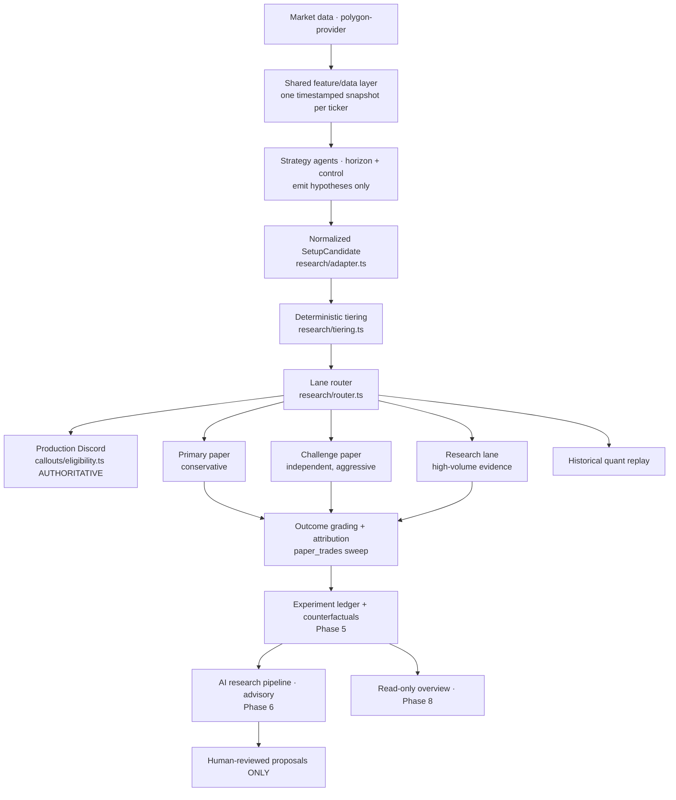

# OptiScan Research Platform — Final Architecture

Status: **rebuild complete (Phases 0–9)**. Baseline `ac4f045` → final on `main`.
All new capabilities ship **OFF by default**; production behavior is unchanged until an
owner explicitly enables a flag. This document is the authoritative architecture map.

## 1. Component diagram

**Deterministic validation + tiering and the lane router are the production authority.**
Probabilities / model / AI outputs never override a hard deterministic gate.

## 2. Lanes & tier eligibility matrix

Tiers (`research/tiering.ts`, deterministic; stale-or-uncontractable ⇒ REJECTED_INVALID):
`PRODUCTION_QUALITY`, `EXPERIMENTAL_VALID`, `NEAR_MISS_VALID`, `REJECTED_INVALID`.

| Lane | Eligible tiers | Fills? | Cooldown | Flag |
|---|---|---|---|---|
| Production Discord | PRODUCTION_QUALITY (via `callouts/eligibility.ts`, **not** the router) | n/a | dedup (unchanged) | `AGENT_CALLOUT_DISCORD` (existing) |
| Primary Paper | PRODUCTION_QUALITY | yes, **min 1 contract** | account-wide (stricter) | `PAPER_AUTO_ENTRY` (existing) |
| Challenge Paper | PRODUCTION_QUALITY + EXPERIMENTAL_VALID | yes, w/ defensible quote | per-ticker | `CHALLENGE_INDEPENDENT_ENABLED` |
| Research | PROD + EXPERIMENTAL + NEAR_MISS (defensible quote) | yes, w/ defensible quote | per-ticker + per-strategy | `RESEARCH_LANE_ENABLED` |
| Historical Quant | offline replay | stock only | n/a | `HISTORICAL_REPLAY_ENABLED` |

`REJECTED_INVALID` **never** routes to any fill lane (recorded for counterfactual analysis only).
Puts stay research-only (bearish-gate → RESEARCH_ONLY → EXPERIMENTAL_VALID → never Primary/Discord).

## 3. Authoritative ownership (one owner per concern)

| Concern | Authoritative component |
|---|---|
| Production eligibility (Discord) | `lib/callouts/eligibility.ts` (`nowOnlyActionable`) |
| Bearish safety | `lib/bearish-gate.ts` (final authority; `BEARISH_ACTIONABLE` off) |
| Tier classification | `lib/research/tiering.ts` |
| Candidate normalization | `lib/research/adapter.ts` |
| Lane routing | `lib/research/router.ts` + `lib/research/lane-policy.ts` |
| Primary/Challenge/Research execution | `lib/paper-engine.ts` (`createLanePaperTrade`, `createSinglePaperTrade`) |
| Per-lane/per-ticker cooldown | `lib/research/cooldown.ts` |
| Experiment enrollment | `lib/research/experiment-ledger.ts` |
| Fill honesty | `experiment-ledger.ts` (`hasDefensibleFill`) + tiering |
| Counterfactual grading | `lib/research/counterfactual.ts` |
| Strategy evaluation | `lib/research/counterfactual.ts` + `lib/research/ai-pipeline.ts` |
| AI proposals (advisory) | `lib/research/proposals.ts` |
| Historical replay | `lib/research/historical-replay.ts` + `replay-provider.ts` |
| Diagnostics | `lib/research/overview.ts` + `app/api/research/overview/route.ts` |
| Provider abstraction / quote+contract validation | `lib/polygon-provider.js`, `lib/data-freshness.ts`, `lib/options-universe-policy.ts` |

### Compatibility layers (retained, documented, NOT dead)
- **`maybeMirrorToChallenge` (Primary-mirror Challenge)** — the pre-rebuild path. Coexists with
  the independent consumer; dedup-guarded (`UNIQUE(alert_id,portfolio)` / `(setup_id,portfolio)`).
  Retained for `PAPER_CHALLENGE_ENABLED` back-compat. Intended path is the independent consumer
  (`CHALLENGE_INDEPENDENT_ENABLED`). Removing the mirror would change current Challenge behavior →
  requires owner sign-off (see Future Work).
- **Legacy `autoEnterFromAlerts`** — stands down via `legacyPaperAutoEntrySuppressed()` when the
  supervisor is the canonical Discord/paper path. Retained for non-supervisor deployments.
- **`alert_tier='research'` label** — old "slow-scan / history-only" gate that keeps Discord
  selective; distinct from (and complementary to) the new Research **lane**.

## 4. Agent registry (27; see `research/strategy-agents.ts`)
- **10 ACTIVE options producers** (adapters over existing horizon agents): `call_{0DTE,1-5,6-10,11-35,36-90}`, `put_research_{…}` (puts research-only).
- **5 ACTIVE context/review**: `options_liquidity_contract`, `volatility_iv_context`, `market_regime` (context); `risk_agent`, `data_quality` (review — emit no candidates, cannot relax gates).
- **12 INACTIVE_MISSING_DATA** (each lists exact missing data; emit nothing): stock `momentum_acceleration`, `breakout`, `news_catalyst`, `premarket_afterhours`, `reversal`, `sector_sympathy`; options `earnings_options_research`; research `trade_review`, `counterfactual_review`, `pattern_discovery`, `strategy_evaluation`, `portfolio_allocation_research`.

Agents **never** send Discord, create trades, route, or bypass gates (structural + tests).

## 5. Database tables (all additive, `CREATE TABLE IF NOT EXISTS` / guarded ALTER)
`setup_candidates`, `setup_gate_results` (P1); `lane_routes` (P2); `paper_trades` attribution
columns + `setup_candidates` quote columns (P3); `research_experiments`, `research_enrollments`,
`counterfactual_outcomes` (P5); `ai_research_runs`, `ai_research_findings`, `research_proposals`,
`ai_training_rows` (P6); `replay_runs`, `replay_outcomes` (P7). Fills/outcomes reuse `paper_trades`
(one execution model). Idempotency via UNIQUE keys throughout.

## 6. AI boundaries
Deterministic/statistical only. AI writes advisory findings/proposals/training rows; it **cannot**
send Discord, create trades, route, change balances, enable flags, or alter thresholds/config.
Proposals never default APPROVED and never auto-apply (`applyProposal` is a hard no-op).
Research-trained models never reach PRODUCTION_ELIGIBLE without the separate production validation.
Language-model narrative components are intentionally not implemented (stay in `lib/ai/`, inactive).

## 7. Provider limitations (honest)
- **Stock historical**: available via `/v2/aggs` (OHLCV). Depth/second-resolution depend on plan.
- **Options historical**: **INACTIVE_MISSING_PROVIDER** — the integration provides only a
  present-time `/v3/snapshot/options`; historical option quotes/Greeks/NBBO/OI/spreads are not
  integrated or entitled. None are ever fabricated; options replay ships complete but inactive.

## 8. Paper-only guarantee
No live broker, no real-money execution anywhere. Primary/Challenge/Research are paper portfolios.

## 9. Known limitations & Future Work
- Strategy-Agents-V2 framework and the experiment-ledger/AI/replay live runners are **not wired
  into the live cycle** — they are complete, tested, flag-gated infrastructure that ships inactive.
  Wiring V2 agents to feed the router (replacing the supervisor's implicit agent set) is future work.
- Stock research agents are INACTIVE_MISSING_DATA until stock features are threaded into the shared
  `StrategyEvaluationContext`.
- The `maybeMirrorToChallenge` compatibility path should be retired once `CHALLENGE_INDEPENDENT_ENABLED`
  is validated in production (owner decision).
- Historical options replay awaits a provider entitlement for historical option data.
- `/research` page is a standalone consolidated view; a nav-shell link is a UI polish item.
